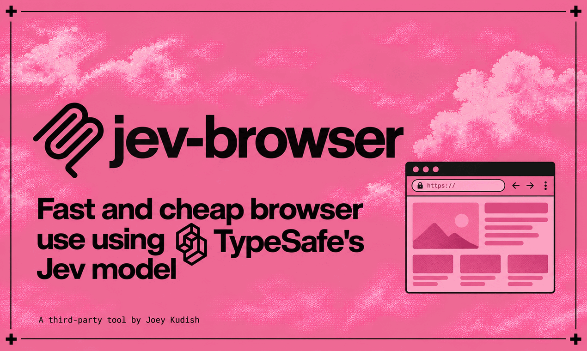

# Jev Browser

[](https://github.com/jkudish/jev-browser/actions/workflows/ci.yml)
[](LICENSE)

<p align="center">
  
</p>

Fast and very cheap browser use using TypeSafe's Jev model.

Give jev-browser a task and a URL.

It drives a real headless browser through an MCP server, CLI, or library. TypeSafe's Jev model picks one action per step from the page's clickable, typeable, and selectable elements, and scores how likely it is that the goal is met or the run is stuck. Code owns the loop: budgets, recovery, stop gates. You get the final page, a step trace with confidences, console errors, and a screenshot.

Things it has done on real sites, not demos:

- Navigated Wikipedia from the Coffee article to Espresso in about 4 seconds, for $0.0016.
- Filled a contact form and stopped without submitting it.
- Pulled the price off a live pricing page.
- Returned a full guide page as markdown.
- Produced an accessibility-tree breakdown of a WordPress site.

This is early software. Expect rough edges on harder sites. Issues and pull requests are welcome; see [CONTRIBUTING.md](CONTRIBUTING.md).

## Demo

Searches GitHub for this repository, opens Releases, and answers a question about the page. Every Jev judgment is on the right: the action chosen, its confidence, and the goal and stuck probabilities for each step.


Full-resolution video: [assets/github-demo.mp4](assets/github-demo.mp4).

## Install

Requires Node.js 22 or newer, an API key for a Jev transport ([TypeSafe direct](https://console.typesafe.ai/settings/keys) is the default; alternatives are listed under [Configuration](#configuration)), and optionally a key for a typing provider (see [the typing model](#the-typing-model)). Playwright's Chromium downloads automatically on install; set `JEV_BROWSER_SKIP_BROWSER_DOWNLOAD=1` to opt out.

### Let an agent install it for you

Paste this into your coding agent:

```text
Install the Jev Browser MCP server for me. The package is @jkudish/jev-browser on npm and the server
command is `npx -y @jkudish/jev-browser`; register it as an MCP server with your client. Check whether
TYPESAFE_API_KEY is already set in the server environment; if not, walk me through setting it up without
pasting the key into the chat (I can create one at console.typesafe.ai/settings/keys). When it's
registered, ask if I'd like to run a first navigation task, and when we do, show me the step trace and cost.
Full instructions: https://github.com/jkudish/jev-browser#readme
```

From npm:

```bash
npx -y @jkudish/jev-browser --help
```

<details>
<summary>Amp</summary>

```bash
amp mcp add jev-browser -- npx -y @jkudish/jev-browser
```

</details>

<details>
<summary>Claude Code</summary>

```bash
claude mcp add jev-browser -- npx -y @jkudish/jev-browser
```

</details>

<details>
<summary>Codex (<code>~/.codex/config.toml</code>)</summary>

```toml
[mcp_servers.jev-browser]
command = "npx"
args = ["-y", "@jkudish/jev-browser"]
```

</details>

<details>
<summary>OpenCode (<code>opencode.json</code>)</summary>

```json
{
  "mcp": {
    "jev-browser": {
      "type": "local",
      "command": ["npx", "-y", "@jkudish/jev-browser"],
      "environment": { "TYPESAFE_API_KEY": "ts_..." }
    }
  }
}
```

</details>

<details>
<summary>Any other MCP client</summary>

```json
{
  "mcpServers": {
    "jev-browser": {
      "command": "npx",
      "args": ["-y", "@jkudish/jev-browser"],
      "env": { "TYPESAFE_API_KEY": "ts_..." }
    }
  }
}
```

</details>

Some MCP clients filter the environment before spawning servers, which silently drops `TYPESAFE_API_KEY`. If the server reports a missing key, pass it explicitly as shown above.

## Without MCP: CLI and library

The same agent runs from the command line. Result JSON is printed to stdout.

```bash
npx -y @jkudish/jev-browser run "Find the newest release and stop on it" https://github.com/jkudish/jev-browser/releases
```

CLI options include `--format`, `--max-chars`, `--max-steps`, `--max-seconds`, `--no-typing`, `--screenshot path.jpg`, `--record path.webm` (or a directory for Playwright's raw output), and `--cookie-file name=@path` to start behind a login. Run with `--help` for the full list.

There are two ways onto an authenticated page: the [password fill](#password-fill-logins) (the agent types nothing; code fills the field) and seed cookies (the run starts already logged in). The agent never types into password fields, so pick one of those two. For cookies, the value is read from a file so a session token never appears in argv, shell history, or the process list; there is deliberately no `--cookie name=value` flag.

```bash
npx -y @jkudish/jev-browser run "Open the newest order and stop on it" https://app.example.com/orders \
  --cookie-file "session=@$HOME/.cache/example-session"
```

Or import it as a library. The package entry exports `navigate` side-effect free: importing it starts no server and no browser until you call it.

```js
import { navigate } from "@jkudish/jev-browser";

const result = await navigate({
  task: "Find the price of the Pro plan",
  startUrl: "https://example.com/pricing",
  format: "markdown",
  maxSteps: 16,
  cookies: [{ name: "session", value: process.env.EXAMPLE_SESSION }], // optional seed cookie; see "Seed cookies" below
});

if ("error" in result) throw new Error(result.error);
console.log(result.status, result.final_url);
console.log(result.page.content);
```

### Judgment transports in the library

The built-in Jev transports are TypeSafe, OpenRouter, Cloudflare, and Vercel, selected in that order from configured credentials. Selection and answer validation live in the shared [@jkudish/jev-agent-tools](https://github.com/jkudish/jev-agent-tools) package. `JEV_PROVIDER` forces one of them; an unknown name or missing credential is an error. This is separate from the typing model. Library callers can provide a transport instead, bypassing judgment provider detection without changing typing configuration:

```ts
import { navigate, type JevTransport } from "@jkudish/jev-browser";

const transport: JevTransport = {
  name: "my-gateway", // reported as jev_provider
  async ask({ state, questions, model, signal }) {
    const response = await myGateway.decide({ state, questions, model, signal });
    return {
      answers: response.answers,
      usage: { input_tokens: response.inputTokens, output_tokens: response.outputTokens },
      model: response.effectiveModel,
    };
  },
};

const result = await navigate({ task: "Find the price", startUrl: "https://example.com", transport });
```

`ask` receives the page state, named questions, requested model, and run abort signal. Return an answer for every requested ID in the matching Jev shape, plus nonnegative integer token counts and the effective model. Choice distributions must cover exactly the offered criteria, sum to about 1, and select a maximum; Noul values must be in [0,1]. Invalid answers stop the run before the action executes. `est_cost_usd` stays a Jev-token estimate, not verified billing for injected carriers.

## Password fill (logins)

The agent can fill native password fields without the password ever reaching a model. The value arrives through one of three channels, lives in memory for a single run, and is scrubbed from every state, trace, error, URL, and payload the run produces. Video recording is refused on credential runs and the final screenshot is suppressed once a fill is attempted (on injected pages, which may already show the value, from the start of the run). A fill never submits: no Enter, no click.

Set the trust anchor once, in the MCP server's environment:

```bash
JEV_BROWSER_PASSWORD_ORIGIN=https://acme.com
```

That must be an exact origin (scheme, host, port; no wildcards; http is allowed only on localhost). Fills happen only on that origin. Anywhere else the fill is refused and the refusal shows in the step trace as `origin_mismatch`.

Then pipe the secret in per run. Any producer that can print bytes works: 1Password, Bitwarden, `pass`, LastPass, the macOS Keychain, `secret-tool`, Vault, a plain file, or an environment variable you already have.

**MCP, via a one-shot handoff file.** The server only accepts files placed directly inside its handoff directory (default `~/.jev-browser/handoff`, mode 0700), validates them (owner, mode 0600, single link, no symlinks, sane size), and deletes them at run start:

```bash
mkdir -p ~/.jev-browser/handoff && chmod 700 ~/.jev-browser/handoff
pwfile="$HOME/.jev-browser/handoff/pw.$$"
op read --no-newline --out-file "$pwfile" 'op://Work/acme/password'
chmod 600 "$pwfile"
```

```jsonc
// arguments
{
  "task": "Log in and open the billing page",
  "start_url": "https://acme.com/login",
  "password_file": "/home/you/.jev-browser/handoff/pw.12345"
}
```

**MCP, via an environment variable.** Naming a variable `JEV_PASSWORD_*` is the opt-in. Any other name is rejected before its value is ever looked up, so the model cannot probe the server's environment:

```bash
# once, in the MCP server's environment:
JEV_PASSWORD_ACME="$(op read --no-newline 'op://Work/acme/password')"
```

```jsonc
// arguments
{
  "task": "Log in and open the billing page",
  "start_url": "https://acme.com/login",
  "password_env": "JEV_PASSWORD_ACME"
}
```

**CLI, straight from a pipe.** `-` reads the secret from stdin, so it never appears in argv, the environment, or process listings:

```bash
op read --no-newline 'op://Work/acme/password' |
  npx -y @jkudish/jev-browser run "Log in and open the billing page" \
    https://acme.com/login --password-file - --password-origin https://acme.com
```

Rules and limits of the mechanism, stated plainly:

- `password_file` takes a local pathname only. Never put the password value in the task, in tool arguments, in argv, or in the filename.
- Library callers pass `password: { value, origin }` in the `navigate()` options instead; the same validation, origin binding, and redaction apply.
- Handoff files are one-shot: read and unlinked at run start. Recreate the file for every run.
- The mechanism needs the agent's shell and the MCP server to share a filesystem. It does not protect against a host agent that reads the file itself or runs your secret manager without redirection; treat the `op read` command as operator-approved.
- The trusted origin can read and transmit the password, and its pages can submit from an input event with no Enter key. Origin binding does not make a compromised site safe.
- Redaction is defense in depth: raw, percent-encoded, form-encoded, HTML-encoded, markdown-escaped, whitespace-normalized, and YAML-escaped (aria snapshots) echoes of the value are scrubbed from everything the run returns, including values a page reflects into its own labels, attributes, console output, or URLs after the fill. On credential runs every capture window (labels, options, hrefs, excerpts, error strings) is sized to the longest known representation of the value, so an echo is always captured whole and redacted before any length cap can cut it; dropdowns are selected by DOM index, never by a label string; the task itself is scrubbed before any model sees it, so "the model never sees the value" holds even if a caller ignores this advice and puts it in the task. Secrets containing a line break or any control character, or whose echo-normalized form (whitespace collapsed, zero-width characters stripped) collapses below the safe redaction length, are rejected up front (produce it with `op read --no-newline` or equivalent). Redaction cannot cover arbitrary transformations, process-memory inspection, or OS-level monitoring. For the same reason, credential runs refuse any Playwright debug output (`PWDEBUG`, any nonempty `DEBUG`, `DEBUG_FILE`) and video recording.
- On runs without a password source, password inputs are skipped during extraction entirely: the feature costs nothing when unused.
- Every password field the model fills in a run receives the same configured value; this is for logging in, not for setting new passwords. `allow_typing: false` disables the feature entirely.


## Seed cookies (start behind a login)

Seed cookies put a session captured elsewhere (a browser profile, a login script, your secret manager) into the run's browser context before the first navigation, so the run starts already logged in. Password fill and seed cookies are the two supported ways onto an authenticated page; the agent never types into password fields itself.

Cookie values are credentials of the same rank as the password value:

- They never enter arguments the model composes. The CLI reads values from files (`--cookie-file name=@path`, repeatable); the MCP tool reads them from one-shot handoff files (`cookie_file`) or `JEV_COOKIE_*` environment variables (`cookie_env`), exactly the reference-based delivery the password uses. Library callers pass `cookies: [{ name, value }]` in the `navigate()` options, like `password: { value, origin }`.
- Every value is redacted from all model-facing state, traces, errors, console events, and the result payload, with the same machinery the password uses (raw, percent-encoded, form-encoded, HTML-entity, markdown-escaped, and aria-YAML-escaped echoes). With several cookies, or a cookie plus a password, every value redacts, longest first.
- Video recording is refused, and the final screenshot is suppressed from run start: the very first rendered page can already reflect a cookie value into pixels, and frames cannot be redacted.
- Runs with an injected `page` are refused: `addCookies` would mutate a context your application owns.
- Values are validated like passwords: a run refuses a value that is empty, longer than 4096 bytes, shorter than 4 characters, or containing control characters (which no serializer could echo back redactably).

What a seed cookie gets when you supply only a name and a value:

| Field | Default | Why |
| --- | --- | --- |
| `domain` | none (host-only) | The cookie binds to the start URL's exact host and never matches subdomains, which is what a session cookie captured in a browser usually is. Supply `.example.com` (leading dot) only when the site really sets a subdomain-matching cookie. `__Host-` names must stay host-only and are rejected with an explicit domain. |
| `path` | `/` | Sent site-wide, not just under the start URL's directory. `__Host-` names require it. |
| `secure` | true on https start URLs | Browsers refuse session cookies over plain http otherwise; loopback http fixtures still seed. Forced true for `__Host-` and `__Secure-` names and for `sameSite: "None"`; an explicit `secure: false` cannot strip the forced flag. |
| `httpOnly` | true | Page scripts cannot read the seeded value; the server still receives it on every request. Set `httpOnly: false` only when the site's own JavaScript must read this cookie. |
| `sameSite` | `Lax` | The browser default for session cookies. |

```bash
# CLI: value from a file, one flag per cookie
npx -y @jkudish/jev-browser run "Open the newest order and stop on it" https://app.example.com/orders \
  --cookie-file "session=@$HOME/.cache/example-session"
```

```jsonc
// MCP arguments: one-shot file inside the handoff directory, consumed and
// deleted at run start, exactly like password_file
{
  "task": "Open the newest order and stop on it",
  "start_url": "https://app.example.com/orders",
  "cookie_file": [{ "name": "session", "file": "/home/you/.jev-browser/handoff/session.12345" }]
}
```

```bash
# MCP: environment variable opt-in, exactly like password_env
JEV_COOKIE_SESSION="$(cat ~/.cache/example-session)"
```

```jsonc
{ "task": "Open the newest order and stop on it", "start_url": "https://app.example.com/orders",
  "cookie_env": [{ "name": "session", "env": "JEV_COOKIE_SESSION" }] }
```


## Reuse an existing Playwright page

Pass an existing Playwright `Page` when the browser, context, or session is owned by your application. This is useful for logged-in sessions and for applications that already manage the browser lifecycle. When `page` is supplied, `startUrl` is optional; if both are supplied, navigation starts by going to `startUrl`. Jev Browser never closes the injected page, context, or browser.

```js
import { chromium } from "playwright";
import { navigate } from "@jkudish/jev-browser";

const browser = await chromium.launch({ headless: false });
const context = await browser.newContext({ storageState: "./auth.json" });
const page = await context.newPage();

try {
  const result = await navigate({
    task: "Find the price of the Pro plan",
    page,
    maxSteps: 16,
  });

  if ("error" in result) throw new Error(result.error);
  console.log(result.status, result.final_url);
} finally {
  await browser.close();
}
```

Notes for injected pages:

- Video recording is refused: `recordDir` belongs to the context Jev Browser creates, and an injected context cannot get it, so `recordDir` plus `page` throws up front. Password runs are also refused when the injected page itself is being recorded, because video frames cannot be redacted.
- Password fill works the same as on owned runs: the same delivery channels, origin binding, and redaction apply, and the caller's browser is never closed.
- Your own tracing or HAR recording on the caller side is invisible to Jev Browser and captures everything the page sees, including filled values. If a credential run may pass through, stop tracing first; that is operator responsibility, same as with any other Playwright tooling.
- Treat the injected context as exclusively Jev Browser's for the duration of the run: every new page the context gains is observed, and the most recent one can become the active page (same adoption rule as owned runs). Pages your own code opens concurrently in that context can therefore redirect the run and mix their diagnostics into its result, so open unrelated tabs only after the run returns.

## The tool

Every run makes paid TypeSafe API calls, typically a fraction of a cent, plus one small LLM call per typed field when a typing provider is configured. The example below is a real run.

```jsonc
// arguments
{
  "task": "Search Wikipedia for the espresso-based drink called Ristretto and stop when you are on that article",
  "start_url": "https://en.wikipedia.org/wiki/Main_Page"
}
```

```jsonc
// live result, abridged
{
  "status": "done",
  "final_url": "https://en.wikipedia.org/wiki/Ristretto",
  "elapsed_ms": 3601,
  "steps": [
    { "step": 1, "proposed_action": "click_e2", "executed_action": "click_e2", "detail": "a \"Search Wikipedia [f]\" -> /wiki/Special:Search", "confidence": 1.0 },
    { "step": 2, "proposed_action": "search_e1", "executed_action": "search_e1", "detail": "searched \"Ristretto\" via openrouter", "confidence": 0.99 },
    { "step": 3, "proposed_action": "done", "executed_action": null, "detail": "done proposed; not executed", "confidence": 0.99 }
  ],
  "usage": { "jev_calls": 3, "input_tokens": 51748, "est_cost_usd": 0.0022 },
  "degraded": false,
  "warnings": [],
  "typing_provider": "openrouter",
  "typing_model": "google/gemini-2.5-flash-lite"
}
```

Parameters: `max_steps` (default 24), `max_seconds` (default 180), `allow_typing` (default true), `format` (`text`, `markdown`, `html`, `aria`), `max_chars` (override the cap), `screenshot` (`final`, default, or `none`), `cookie_file` / `cookie_env` (seed cookies by reference: handoff-file paths or `JEV_COOKIE_*` names, plus optional `domain`/`path`/`secure`/`httpOnly`/`sameSite`; see [Seed cookies](#seed-cookies-start-behind-a-login)).

## What you get back

**The final page, in the format you ask for.** Every payload reports `truncated` and `true_length`, and `max_chars` overrides any default.

| Format | Default cap | Best for |
| --- | --- | --- |
| `text` | 8,000 chars | Feeding the page to Jev or an LLM next; quick reads |
| `markdown` | 16,000 chars | Readable artifacts and notes; carries navigation chrome |
| `html` | 1 MB | Parsing the page yourself with your own selectors |
| `aria` | 16,000 chars | The accessibility tree as YAML; what screen readers and agents see |

**A final screenshot.** A viewport JPEG that renders inline in MCP clients, or lands as a file with the CLI's `--screenshot path.jpg`. Pass `screenshot: "none"` to skip it.

**A debug trace you can audit.** One record per step: the proposed action versus the action actually executed, why a recovery fired, action errors, the Choice confidence, the top option's probability, and the goal and stuck probabilities for that step. Stop statuses say which gate fired. Alongside the trace: console errors, page errors, and failed network requests captured per step and tagged with the page they came from, up to 200 events, plus Jev call counts, token usage, and estimated cost. If the final payload or screenshot could not be extracted, the run still returns and lists the problem under `extraction_problems`.

**Typing degradation, visible or it did not happen.** Every result, success or error, carries `degraded` (boolean), `warnings` (array), and `typing_provider`/`typing_model` (what a typing action would use, or null when nothing is configured or typing is disabled). A clean run reports `degraded: false` and an empty `warnings` array. Each warning has the shape `{ code, step, message, provider, model, finish_reason?, fallback? }` with one of four codes: `typing_fallback_no_provider` (no typing provider configured), `typing_generator_empty` (the model returned no text), `typing_generator_error` (the provider call failed), or `typing_configuration_error` (the typing endpoint rejected the request as malformed). Warning messages are short summaries, never raw provider response bodies. Degradation never turns a completed run into a tool error or a nonzero CLI exit; the CLI prints one line to stderr and the JSON tells the rest.

**Bot protection, named instead of endured.** When a Cloudflare interstitial is on the page (the "Just a moment..." challenge, a hard block), the run stops with status `blocked` instead of spending further Jev calls or steps on the interstitial (steps from before it appeared still ran and stay in the trace). The result carries `bot_protection: { provider, kind, evidence, guidance }`. `kind` is `challenge` (an interactive or JS challenge) or `block` (outright denial, no wait). A detected challenge first gets a short bounded window (8s, within the run budget) to clear itself; one that auto-passes lets the run proceed normally, and `blocked` is only declared when the challenge was still there after that window. A wall that only appears on the final page (after the last action, or under a done/goal judgment) gets the same settle window and flips the outcome to `blocked` if it persists, so a confident `done` can no longer wrap a challenge page; if it clears in the window, the outcome stands and the reported page is the real content that painted. When the run budget is too exhausted to run that window, the deadline outcome (`timeout`) keeps precedence and the wall is reported as annotation instead of being claimed as the outcome. `evidence` lists the markers that fired: page detection (the only kind that can stop a run) is DOM-only and self-sufficient: a Cloudflare-signature or branded challenge title (generic wordings like "Verify you are human" count only when a Cloudflare-brand body marker is also on the page) or three distinct body markers including at least one brand phrase (a Ray ID, the Cloudflare attribution, an error code), so content that merely quotes a challenge line is not flagged; the `cf-mitigated` response header is recorded as evidence and annotation but never corroborates stopping, because it is last-seen state and a challenge that auto-passed still answers with the header. `guidance` says what can actually work: a `cf_clearance` cookie is bound to the browser and IP that earned it, so seeded cookies do not clear challenges, and the reliable path is running from the browser session that earned the clearance (reuse its page) or the site's API. Detection is marker-based and Cloudflare-specific today; other CDNs fall through to normal page content.

## How it decides

Each step makes one primary Jev call with three questions over the same state: an action Choice over the page's interactive elements plus scroll/back/done, a goal Noul, and a stuck Noul ([fan-out pattern](https://docs.typesafe.ai/patterns/fan-out.md)). The state includes a short excerpt of the page's visible text, so the goal judgment can see content, not just URLs and links. A select action adds one second-stage Choice for its option. Elements come from the DOM directly, not the accessibility tree, because accessibility trees under-report inputs; the agent found DuckDuckGo's search box only after this switch. Actions: click, search, type, select a native dropdown, submit, scroll, back, done.

Three of those actions move text or forms, and the boundaries are deliberate. Search boxes, identified structurally as `input[type=search]` or `role=searchbox` and nothing else, get a single `search_eN` action that types the query and runs the search in one step. Submit controls (`button[type=submit]`, `input[type=submit]`, and a `button` with no type attribute inside a form) are offered as `submit_eN` instead of `click_eN`. Every other single-line text field offers two actions: `type_eN`, which types without submitting, and `submit_eN`, which presses Enter on that field to submit. So filling one field of a multi-field form never submits it under the agent's feet, and a field that only looks like a search box (a plain text input in a div with a JavaScript Enter handler) never gets the one-action search.

Stop conditions, in code, checked before executing the step's proposed action: the agent chooses `done`, goal probability > 0.85, stuck probability > 0.85, the step budget, or the time budget. A repeated action with no effect switches to the next-best option from the Choice distribution. There is deliberately no low-confidence override: split probability across several similar elements is usually several acceptable alternatives, not uncertainty.

Statuses: `done` (agent chose to stop), `goal_achieved` (the goal watcher fired), `stuck`, `max_steps`, `timeout`, `error`, and `blocked` (a bot-protection interstitial stopped the run; see "What you get back"). `done` and `goal_achieved` are two independent judgments; agreement between them is what a trustworthy finish looks like, and the trace shows both at every step.

## The typing model

Jev never generates text. It returns typed decisions only: which option, with what probabilities. So when a task needs a string, typing a search query or filling a field, that string comes from a small model you choose. This is the only place a second model is involved, and it runs once per typed field, so a multi-field form makes one call per field. Each call is capped at 256 output tokens on OpenRouter (reasoning is disabled there, since reasoning models can burn the whole budget on hidden tokens and return empty text) and 48 tokens on every other provider.

`JEV_PROVIDER` is not involved here at all: it selects the transport for the Jev judgments and has nothing to do with typing. Typing configuration is a separate set of variables.

Configuration is automatic when possible. With no typing overrides set, the server picks the first provider whose key it recognizes, in this order:

| Provider | Recognized by | Default model |
| --- | --- | --- |
| OpenAI | `OPENAI_API_KEY` starting with `sk-` | `gpt-5.6-luna` |
| OpenRouter | `OPENROUTER_API_KEY` starting with `sk-or-` | `google/gemini-2.5-flash-lite` |
| Anthropic | `ANTHROPIC_API_KEY` starting with `sk-ant-` | `claude-haiku-4.5` |
| Google | `GEMINI_API_KEY` or `GOOGLE_GENERATIVE_AI_API_KEY` starting with `AIza` | `gemini-2.5-flash` |

Mind the trap in that order: a stale `OPENAI_API_KEY` left in the environment silently wins detection even when your real key is OpenRouter's. `typing_provider` in the result always names what a run actually used.

Overrides:

- `JEV_BROWSER_TYPE_MODEL` picks any model the resolved provider offers. The value passes through unchanged, so use the provider's plain model id, for example `anthropic/claude-haiku-4.5` on OpenRouter (no `openrouter:` prefix).
- `JEV_BROWSER_TYPE_PROVIDER` strictly selects one of `openai`, `openrouter`, `anthropic`, `google`. No other provider is tried: an unknown value, or a missing or malformed key for the named provider, is a configuration error and the run refuses to start before any browser opens. Runs with `allow_typing: false` ignore typing configuration entirely.
- `JEV_BROWSER_TYPE_BASE_URL` (plus `JEV_BROWSER_TYPE_API_KEY` if it needs one) points at any OpenAI-compatible endpoint: Ollama, LM Studio, vLLM, a gateway. On its own it selects that endpoint regardless of any cloud keys present; combined with `JEV_BROWSER_TYPE_PROVIDER` it becomes the named provider's endpoint instead of its public one. It must be an absolute http(s) URL or the run refuses to start.

Local example, no cloud key at all:

```bash
JEV_BROWSER_TYPE_BASE_URL=http://localhost:11434/v1 JEV_BROWSER_TYPE_MODEL=qwen2.5:7b \
  npx -y @jkudish/jev-browser run "Search Wikipedia for Ristretto and stop on the article" https://en.wikipedia.org/wiki/Main_Page
```

With no provider at all, or when the typing model fails or returns empty text, the two field kinds part ways. A `search_eN` field falls back to a keyword heuristic built from the task text (labeled `via keyword-heuristic` or `via keyword-heuristic-after-generator-error` in the trace; it is meaningfully worse: in testing its queries buried a target article eight results pages deep). An ordinary `type_eN` field types nothing at all: the step records an action error ("typing generator failed; nothing was typed") rather than filling a username or email field with task keywords, which used to look like a typing attempt while guaranteeing failure. Both cases are reported as structured warnings (see above), so a silent wrong-text fill and a silent empty field are both impossible. Give it a real model if your tasks type anything.

## Limits

- Up to 240 elements per step; Jev's Choice supports 255 options. Beyond that the list is truncated and the state says so, which can hide the needed element on very dense pages.
- The markdown format converts the whole body, so it carries navigation chrome and can include inline script text; a readability pass is a candidate improvement, not a committed one.
- Password fields are only ever filled by code, never typed by the model, and only when a password source is configured (see [Password fill](#password-fill-logins)); file inputs are never offered. Start behind a login with [seed cookies](#seed-cookies-start-behind-a-login) (`cookies` on `navigate()`, `--cookie-file` on the CLI, `cookie_file`/`cookie_env` on MCP). Hover-revealed menus, keyboard actions other than Enter within the explicit search and submit actions (Escape, Tab, arrow keys), shadow DOM, and iframes are out of scope for v0.1.
- Thresholds (0.85 goal, 0.85 stuck, budgets) are starting points measured on Wikipedia and DuckDuckGo tasks. Tune them for your sites.
- Jev is calibrated, not infallible. Treat the trace as evidence, not proof.

## Configuration

### Providers

Jev judgments ride on the shared [@jkudish/jev-agent-tools](https://github.com/jkudish/jev-agent-tools) wire package. It picks a carrier from your environment, sends the judgment, and validates the answer before any action runs. Four carriers are built in, tried in this order:

- **TypeSafe** (`TYPESAFE_API_KEY`): direct, and the default when set.
- **OpenRouter** (`OPENROUTER_API_KEY`): one key can also run the typing model.
- **Cloudflare Workers AI** (`CLOUDFLARE_API_TOKEN` or `JEV_CLOUDFLARE_API_TOKEN`, plus `CLOUDFLARE_ACCOUNT_ID`).
- **Vercel AI Gateway** (`AI_GATEWAY_API_KEY`).

`JEV_PROVIDER` forces one of them; an unknown name or a missing credential is a configuration error, never a silent fallback. Typing is configured separately with `JEV_BROWSER_TYPE_*`.

The built-ins stay limited to major providers. For anything else, library callers can inject a transport ([Judgment transports in the library](#judgment-transports-in-the-library)), use a published third-party driver package, or publish their own; published drivers get linked here on request. The [add-a-provider guide](https://github.com/jkudish/jev-agent-tools#adding-a-provider) covers all three paths.

| Env var | Default | Purpose |
| --- | --- | --- |
| `TYPESAFE_API_KEY` | none | TypeSafe direct. Default provider when set. |
| `OPENROUTER_API_KEY` | none | Powers both the Jev judgments (when `TYPESAFE_API_KEY` is absent) and, optionally, the typing model. One key runs everything. |
| `CLOUDFLARE_API_TOKEN` + `CLOUDFLARE_ACCOUNT_ID` | none | Cloudflare Workers AI for the Jev judgments; used when no other provider key is present. `JEV_CLOUDFLARE_API_TOKEN` is honored first for separate credentials. |
| `AI_GATEWAY_API_KEY` | none | Vercel AI Gateway for Jev judgments after the other providers. |
| `JEV_PROVIDER` | `auto` | Force `typesafe`, `openrouter`, `cloudflare`, or `vercel` for the Jev calls instead of auto-detection. Judgment transport only; typing is configured separately with `JEV_BROWSER_TYPE_*`. |
| `JEV_BROWSER_MODEL` | `jev-latest` | Pin a Jev version, or `typesafe/jev-1.13` on OpenRouter. |
| `JEV_BROWSER_TYPE_*` | see above | Typing provider, model, and endpoint. |
| `JEV_BROWSER_HEADED` | unset | Set to `1` to watch the browser. |
| `JEV_BROWSER_SKIP_BROWSER_DOWNLOAD` | unset | Set to `1` to skip the Chromium postinstall. |
| `JEV_BROWSER_PASSWORD_ORIGIN` | unset | Required for password fill: the exact origin password fields may be filled on. |
| `JEV_BROWSER_HANDOFF_DIR` | `~/.jev-browser/handoff` | Directory password handoff files must live in (0700). |

### Vercel

With `AI_GATEWAY_API_KEY` set, judgments run through the Vercel AI Gateway at `typesafe-ai/jev`, using the AI SDK's evaluate API. Answers are adapted back to this package's shapes, including TypeSafe's confidence statistic. Gateway calls appear in Vercel logs and budgets.

### Cloudflare

With `CLOUDFLARE_API_TOKEN` and `CLOUDFLARE_ACCOUNT_ID` set (and no other provider key), judgments run through Cloudflare Workers AI at `typesafe/jev`, the single always-current alias. Usage tokens come back on every call. Cloudflare serves one alias rather than pinned versions, and pricing is listed in the Cloudflare dashboard. Direct TypeSafe remains the recommended default when you have several keys.

### OpenRouter

With only an `OPENROUTER_API_KEY`, both the Jev judgments and (with no other typing provider) the typing model run through OpenRouter: one key powers the whole package. The Jev endpoint there is alpha and adds a hop, and it serves pinned versions rather than a `latest` alias, so `jev-latest` maps to `typesafe/jev-1.13`. Direct TypeSafe remains the recommended default when you have both keys.

## Also in the family

Need the judgments without the browser? [Jev MCP](https://github.com/jkudish/jev-mcp) exposes the same model as eleven judgment tools your agent can call anywhere: verify claims against evidence, screen content before it enters context, gauge bare propositions, find and rerank by meaning, batch-classify, decide, compare passages, extract fields, and review or gate patches and completion claims. The npm package is [@jkudish/jev-mcp](https://www.npmjs.com/package/@jkudish/jev-mcp).

## Sponsoring

If you find Jev Browser useful, consider becoming a [sponsor](https://github.com/sponsors/jkudish) or [donating](https://stripe.com/@jkudish).

## Development

```bash
npm install
npm run build
npm test            # unit tests, offline
npm run test:e2e    # live navigation tests; requires TYPESAFE_API_KEY
```

See [CONTRIBUTING.md](CONTRIBUTING.md). To report a vulnerability, see [SECURITY.md](SECURITY.md).

## License

[MIT](LICENSE)
